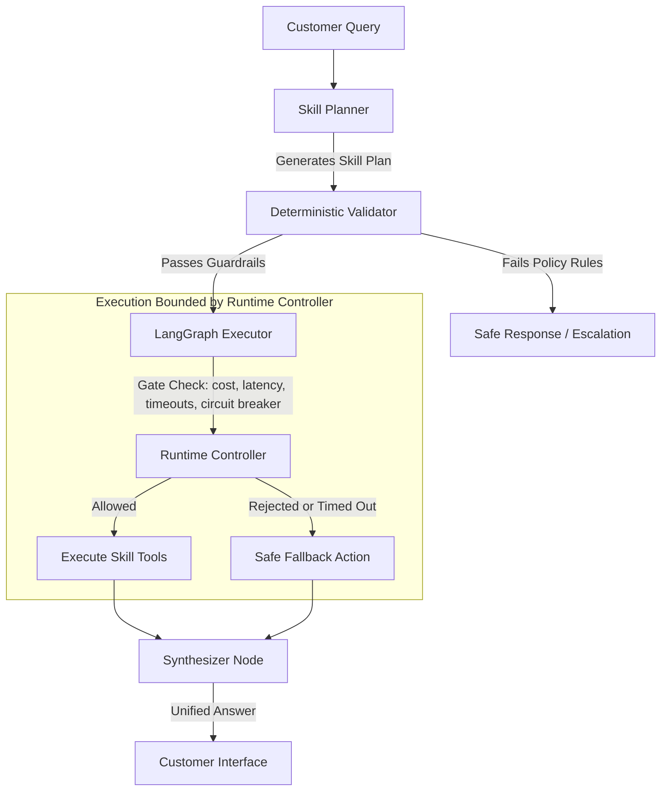

# Production-Grade Multi-Agent Skills Orchestrator (A2A)

A production-grade, highly resilient **Agent-to-Agent (A2A) Multi-Skill Orchestrator** built using **LangGraph**, structured validation, deterministic safety guardrails, and central runtime enforcement (budgets, skill-level circuit breakers, and per-skill timeouts).

Rather than relying on a single, massive LLM prompt to coordinate actions, this architecture adopts a decoupled **Planner-Validator-Executor-Synthesizer** design. Complex customer inquiries are planned into multi-step actions (skills), validated against hard policy rules, run safely within strict resource boundaries, and synthesized into cohesive answers.

---

## 🏗️ Architecture & Core Components



### 1. **Decoupled Skills Registry & Tools**
Skills are registered with defined metadata, timeouts, and risk levels, abstracting the underlying micro-tools from the core agent planner.
*   **`orders_skill`**: Tracks shipping times and delivery status.
*   **`billing_skill`**: Triages transaction failures and checks for duplicate payments.
*   **`subscription_skill`**: Accesses plans and executes subscription upgrades.
*   **`policy_skill`**: Checks company policy and handles automatic refunds or escalation routes.

### 2. **Deterministic Validator**
Enforces hard safety rules at the validation layer before any external APIs are invoked:
*   ⚠️ **Payment Safety Rule**: Any subscription upgrade task that involves payment (keywords: `charge`, `price`, `pay`, `credit card`, etc.) **MUST** mandate a `policy_skill` dependency in the plan to check for refund/escalation rules. If missing, the validator blocks execution instantly.

### 3. **Resilient Runtime Controller**
Monitors and wraps every single skill execution with absolute constraints:
*   ⏱️ **True Per-Skill Timeouts**: Specific timeouts mapped to each skill (e.g. `rag_skill` has tight 100ms limits, while others have up to 500ms).
*   💰 **Preemptive Cost Checking**: Calculates estimated execution costs *before* calling tools, preemptively rejecting tasks that would breach the budget.
*   🔄 **Execution Count Limit**: Deterministically terminates requests that exceed `max_skill_calls = 3` to prevent infinite loops.
*   🔌 **Skill-Level Circuit Breaker**: Tracks consecutive failures per skill. If a skill fails `2` times consecutively, the breaker opens, instantly blocking subsequent execution attempts of that skill to protect downstream services.

---

## 📂 Repository Structure

```bash
├── d22_agents_as_tools_baseline.py   # Baseline where multiple agents are treated as standard tools
├── d23_skill_registry.py             # Setup and structure of the decentralized Skill Registry
├── d24_planner_validator_executor.py # Python implementation of the Planner-Validator-Executor flow
├── d25_runtime_constraints.py        # Standalone Runtime Controller (timeouts, breakers, budgets)
├── d26_full_a2a_skills_implementation.py # Production DAG execution using LangGraph
├── shared/
│   ├── config.py                     # Global limits (MAX_SKILL_CALLS = 3, cost limits, latency)
│   ├── schemas.py                    # Strong Pydantic models for plans, outputs, and logging
│   ├── simulated_tools.py            # Mock implementation of database tools
│   └── logging_utils.py              # Central tracing and transaction log generation
└── README.md                         # This file
```

---

## 🚀 Quickstart & Running Tests

Ensure you have your environment activated (configured with `Python 3.10+` and `LangGraph`/`Pydantic`).

### 1. **Run the Full Multi-Agent LangGraph System**
Executes all end-to-end integration tests (standard upgrades, payment upgrades, multi-intent billing queries, and validation failures):
```bash
python d26_full_a2a_skills_implementation.py
```

### 2. **Run Standalone Runtime Constraint Verification**
Executes validation scenarios for limits (max execution calls, latency timeouts, preemptive budget limits, and consecutive-failure circuit breakers):
```bash
python d25_runtime_constraints.py
```

---

## 📊 Live Observability & Tracing

Every skill call prints a clear engine execution trace tag, providing flawless auditability:

```text
[TRACE ENGINE] execute_skill: billing_skill | Task: Check payment status | Priority: high
[TRACE ENGINE] execute_skill: policy_skill | Task: Confirm refund policy | Priority: high
[TRACE ENGINE] execute_skill: subscription_skill | Task: Upgrade subscription plan | Priority: normal
```

And outputs structured JSON events matching production logging metrics:

```json
{"event": "circuit_breaker_opened", "trace_id": "tr_f8c...", "session_id": "ss_b18...", "agent_or_skill": "runtime_controller", "ts_ms": 1779246928557, "meta": {"skill_name": "billing_skill", "failure_count": 2}}
{"event": "skill_rejected", "trace_id": "tr_bf5...", "session_id": "ss_733...", "agent_or_skill": "runtime_controller", "ts_ms": 1779246928316, "meta": {"skill_name": "orders_skill", "reason": "max_total_cost_usd exceeded"}}
```
